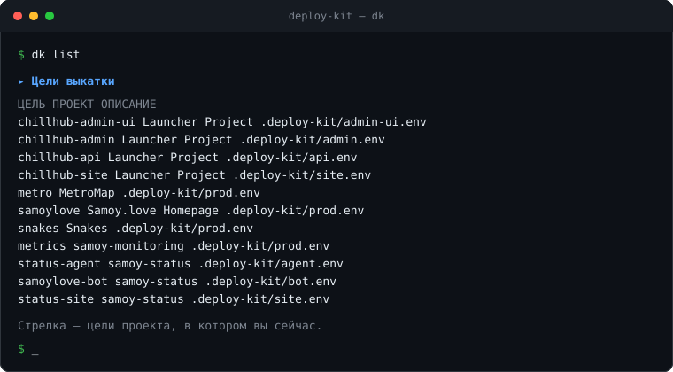

# deploy-kit

Русский · [English](README.en.md)

[](https://github.com/tr0llex/deploy-kit/actions/workflows/ci.yml)
[](LICENSE)


Единый релизный пайплайн всех проектов samoy.love: статические сайты,
Go-сервисы и десктопный установщик едут на прод по одному и тому же конвейеру.



## Зачем

Раньше каждый проект изобретал деплой заново. Откат был только у Snakes —
остальные откатывались повторной выкаткой. Лаунчер прогонял `go test` в
workflow, никак не связанном с деплоем, который шёл следом. Один общий файл
nginx описывал два сайта разом, и выкатка одного роняла соседний. Несколько
репозиториев катят на **один** хост, но мьютекс у каждого был свой — два
пайплайна могли одновременно перезагружать nginx. Имена секретов различались
от репозитория к репозиторию.

Здесь всё это сведено к одному контракту: одно описание цели, один
`release.sh` на сервере, одна очередь на хост. В репозитории проекта остаются
вызов workflow на двадцать строк и файл `.env`.

## Конвейер

Один и тот же для всех архетипов, различается только шаг сборки.

```
1. Гейты         линт, типы, тесты (go test -race для Go), сборка
2. Артефакт      версия из тега либо release-<дата>-<коммит>, упаковка в tar.gz
3. Предусловия   на хосте: место на диске, nginx -t, состояние юнитов, владелец
3a. Шлюз         версия задана и строго новее той, что на проде
4. Загрузка      в releases/<версия>, права и владелец
5. Бэкап         снимок конфига nginx до замены
6. Переключение  атомарная смена симлинка current
7. Применение    nginx -t && reload либо systemctl restart
8. Проверка      /healthz, /version.json = ожидаемая версия, соседние сайты
9. Откат         любой провал после шага 6 возвращает current на прежний релиз
10. Уведомление  сообщение в Telegram: результат и список изменений
```

Шаг 8 сверяет **версию**, а не только код ответа: именно это ловит «деплой
прошёл зелёным, а файлы остались старые». Шаг 3a отказывает версиям-заглушкам
(`dev`, `unknown`, пусто) и всему, что не новее прода, — выход с кодом 3 при
нетронутом симлинке.

## Как устроено

**Прод собирается один раз.** Артефакт собирается на раннере и едет как есть.
На сервере ничего не компилируется, поэтому работает ровно то, что проверили.

**Выкатка атомарна.** Файлы кладутся в новый каталог `releases/<версия>`, и
только потом переключается `current` — через временный симлинк и `mv -T`.
Между `rm` и `ln` было бы окно, когда пути не существует; так его нет, и
половинчатое состояние наблюдать нечем.

**Каждая выкатка проверяет себя, а провал откатывается сам.** После
переключения пайплайн ждёт `/healthz`, сверяет `/version.json` с выкаченной
версией и проверяет соседние домены. Любой провал возвращает `current` на
предыдущий релиз и перезапускает юнит: раз каждый мерж в `main` уезжает на
прод, выкатка без человека обязана уметь отменить себя.

**Хост один — очередь одна.** Мьютекс — `flock` на
`/var/lock/deploy-kit.lock`, на весь хост, а не на репозиторий. Concurrency в
GitHub Actions разводит запуски только внутри одного репозитория, а проекты,
делящие этот сервер, лежат в разных.

**Чужое не трогаем.** Проект пишет ровно один файл в `sites-available` (или
`conf.d`), `nginx-apply.sh` снимает состояние всей конфигурации **до** правки,
чтобы чужую поломку не приняли за нашу, и откатывает релиз из бэкапа, если
после установки `nginx -t` не проходит.

**Скрипты на сервере — тоже релиз.** `install-server` сверяет контрольные
суммы репозитория и `/opt/deploy-kit`, отказывается выкладывать то, что
расходится с `origin/main`, заливает файлы во временный каталог и проверяет их
там через `bash -n`: сломанный `release.sh`, установленный на место, означал
бы, что выкатываться и откатываться уже нечем.

## Стек

Bash (строгий режим, чистый shellcheck), переиспользуемые workflow GitHub
Actions, systemd, nginx 1.24, `flock`, `tar` и `scp` поверх SSH. Сторонних
action для ssh и передачи файлов нет: двадцать строк своего кода вместо
внешней зависимости в цепочке поставки.

## Быстрый старт

`dk` — одна команда на всё хозяйство. Цели обнаруживаются сами: каждый
`.deploy-kit/*.env` в соседних репозиториях становится целью, регистрировать
ничего не нужно.

```bash
echo 'export PATH="$PATH:/путь/к/deploy-kit/bin"' >> ~/.bashrc
mkdir -p ~/.config/deploy-kit && cp dk.conf.example ~/.config/deploy-kit/dk.conf
# в dk.conf — хост, пользователь, путь к ключу и, если нужны уведомления,
# токен с чатом Telegram; значения с пробелами в кавычках
```

```bash
dk                          # что сейчас на проде: коды ответов и версии
dk list                     # все цели
dk deploy                   # все цели проекта, в котором стоите
dk deploy snakes metro      # выборочно
dk deploy --all --dry-run   # показать план, ничего не трогая
dk rollback snakes --list   # какие релизы лежат на сервере
dk rollback snakes          # откатить на предыдущий
dk help
```

Локальная выкатка идёт **тем же путём, что и CI**: одно описание цели и один
`release.sh` на сервере. Расхождения «локально работает, в CI нет» исключены
по построению.

## Локальный запуск

`dk run` — тот же реестр целей, но на своей машине. Отвечает на вопрос «что
здесь вообще запускается и как» — раньше ответ был только в голове.

```bash
dk run --list               # что запускается локально и на каких портах
dk run                      # сервисы проекта, в котором стоите
dk run metro die-game       # выборочно
dk run --dry-run            # каталоги, порты, переменные — ничего не запуская
dk run --branch main        # то же, но на другой ветке
```

`Ctrl-C` гасит всё, что подняла команда, — **по порту, а не по PID родителя**:
`go run` компилирует бинарь и запускает его отдельным процессом, так что порт
держит внук, и убийство родителя оставляло бы сироту.

Запуск описывается там же, где выкатка, — ключами `RUN_*` в
`.deploy-kit/*.env`. Отдельного реестра нет намеренно: два списка целей
однажды разъедутся, и «добавили файл — появилась цель» перестанет быть
правдой. Ключи и то, как ими пользоваться, — в [docs/run.md](docs/run.md).

Контейнеров здесь нет и не планируется: прод — это systemd и `release.sh` на
arm64, Docker локально не воспроизводит ни архитектуру, ни sandbox юнита, ни
nginx, а флагманский клиент — WPF под Windows. Подробнее — в начале
[docs/run.md](docs/run.md).

Обновление серверной части:

```bash
install-server              # показать расхождения репозитория и /opt/deploy-kit
install-server --apply      # выложить (только то, что влито в main)
```

## Уведомления

Статические сайты и Go-сервисы объявляют выкатку в Telegram — из пайплайна и с
машины разработчика одинаково. Об успехе сообщение говорит, что и в какой
версии выкачено, даёт ссылку на компонент и список изменений; о провале — коротко
и про провал. (Установщик под Windows не объявляет ничего: он не едет на прод, а
выкладывается в GitHub Release.)

Токен и чат локальная выкатка берёт оттуда же, откуда хост и ключ: `bin/deploy`
читает `~/.config/deploy-kit/dk.conf` **сам** (путь переопределяется `DK_CONF`).
Раньше файл доезжал до него только через `dk deploy`, который экспортирует
прочитанное в окружение, — и любой другой запуск, руками или из скрипта,
оставлял `TELEGRAM_*` пустыми, а уведомление молча не уходило.

Приоритет: описание цели сильнее окружения, окружение сильнее `dk.conf`. Файл
заполняет только то, чего в окружении ещё нет — в CI переменные приходят из
секретов, и машинный файл не должен их перебивать; а `NOTIFY` или `HEALTH`
конкретной цели не должны перебиваться общей машинной настройкой.

**Ненастроенный чат больше не выглядит как выключенные уведомления.** Молчание
бывает двух сортов — «говорить не о чем» и «сказать хотели, но не смогли»
(нет токена, токен протух, `api.telegram.org` не ответил), — и раньше они были
неотличимы. Теперь второй сорт печатает предупреждение с причиной из ответа
Telegram; в тексте предупреждения оказывается только описание ошибки, URL с
токеном — никогда. Выкатку это не роняет: уведомление — украшение поверх неё.

Чем шумит уведомление, задаёт `NOTIFY` в описании цели:

| `NOTIFY` | В чат уходит |
|---|---|
| `all` — по умолчанию | и успех, и провал |
| `fail` | только провал |
| `never` | ничего; о ненастроенном чате тоже не спрашивают |

Молчать об успехе бывает нужно: у проекта случается свой канал новостей о
релизах, и тогда сообщение отсюда — второй голос об одном событии. Молчать о
провале нельзя: невыкаченное, о котором не сказали, выглядит как выкаченное.

## Список изменений

К сообщению об успехе дописывается список последних коммитов. Собирает его один
общий `bin/changelog`, а не каждое место вызова по-своему: сообщений о релизе в
хозяйстве три — `static-site.yml`, `go-service.yml` и `bin/deploy`, — и стоит
формату разъехаться, лента релизов перестаёт читаться. Генератор отдаёт готовый
кусок сообщения: свой заголовок, уже экранированный HTML. Вызывающая сторона
дописывает его последним и больше ничего с ним не делает.

Диапазон выбирается сверху вниз, первый сработавший выигрывает:

1. `--since <ревизия>` — предыдущий релиз, если вызывающая сторона его знает; в
   workflow это `github.event.before`. Принимается sha, тег и целиком имя версии
   вида `release-20260801-1a2b3c4` — хвостовой коммит достаётся из неё сам.
2. последний тег, достижимый из `HEAD`. Если тег стоит ровно на `HEAD` (релиз
   сначала тегают, потом объявляют), берётся предыдущий — иначе диапазон был бы
   пуст.
3. последние восемь коммитов. Это уже не «изменения с прошлого релиза», зато
   всегда что-то осмысленное и всегда ограниченное.

**История бывает недоступна, и это нормальный исход, а не ошибка.**
Неразрешимая ревизия — не отказ, а переход к следующему пункту: на
shallow-клоне объекта прошлого релиза попросту нет. Нет git, каталог не
репозиторий, история пуста, всё отфильтровано как шум, передан неизвестный
аргумент — везде пустой stdout, код возврата 0 и одна строка с причиной в
stderr. Сообщение в этом случае уходит ровно таким, каким уходило раньше, без
блока изменений. Уронить выкатку генератор не может ни при каком входе.

Поэтому же workflow берут историю глубже одного коммита: `actions/checkout` по
умолчанию привозит ровно один, и рассказывать было бы не о чем. Статическим
сайтам приезжают и теги (`fetch-depth: 50`, `fetch-tags: true`). Go-сервисам
теги не приезжают осознанно: их видит шаг определения версии, и пуш на
отмеченный тегом коммит начал бы давать версию `v1.2.3` вместо `release-…`,
которую версионный шлюз отвергает кодом 3. Полнота списка этого не стоит — без
тегов генератор берёт последние коммиты.

Форма меняется аргументами; у каждого есть одноимённая переменная
`DK_CHANGELOG_*`, и аргумент сильнее переменной:

| Аргумент | По умолчанию | Что задаёт |
|---|---|---|
| `--since`, `--to` | не задано, `HEAD` | границы диапазона |
| `--repo` | `.` | каталог репозитория |
| `--max` | 8 | пунктов в списке; `0` — без предела (потолок 200) |
| `--width` | 120 | символов на тему коммита |
| `--depth` | 8 | сколько коммитов берёт запасной вариант |
| `--budget` | 1200 | символов на весь блок; `0` — без предела (потолок 20000) |
| `--all` | — | снять оба предела: то же, что `--max 0 --budget 0` |
| `--link-base` | не задано | база ссылок на PR, например `https://github.com/tr0llex/deploy-kit` |
| `--no-header` | заголовок есть | убрать строку `<b>Изменения</b>` |
| `--quiet` | — | не объяснять выбор диапазона в stderr |

Считается всё в **символах**, а не в байтах, и это ровно тот же потолок темы,
что записан в CLAUDE.md, — 120. Байты стояли здесь раньше и брали за русскую
букву двойную плату: 100 байт — это 100 латинских букв, но всего 50 русских, то
есть половина нормы. По 287 настоящим темам хозяйства медиана — 50 символов
(76 байт), максимум — 107 символов (145 байт); прежний предел резал посреди
фразы каждую седьмую тему, нынешний не режет ни одной. Предел снова страховка
от аномалии, а не обычное дело.

Локаль на счёт не влияет: скрипт работает под `LC_ALL=C`, где `${#s}` считает
байты, поэтому символы он считает арифметикой по UTF-8 — сколько байтов не
являются продолжением символа (`0x80`–`0xBF`). Результат одинаков на раннере
GitHub и в Git Bash под Windows. Резать посреди символа нельзя ни при каком
пределе: битую строку Telegram отвергает целиком.

Лимит Telegram — 4096 единиц UTF-16 на всё сообщение, и при умолчаниях запас
остаётся трёхкратным: восемь пунктов по 120 кириллических символов — 960 единиц,
шапка и хвост — около 35, само сообщение о выкатке — около 150.

### Полный список вместо хвоста

`--all` (то же самое, что `--max 0` и `--budget 0`) снимает пределы — но ради
`version.json`, а не ради чата. Обрезаний по дороге до читателя два, и **первое решает всё**: в
`version.json` попадает ровно то, что напечатал генератор, а ни бот, ни
статус-страница не читают историю git — они читают файл. Чего в файле нет, того
им не показать, как их ни правь. Поэтому все три пути выкатки зовут генератор
без пределов: полный список релиза уезжает в файл, и хвост «…и ещё 1 коммит»
исчезает не потому, что его прячут, а потому, что обрезать стало нечего.

Потолок при снятых пределах остаётся — 200 пунктов и 20000 видимых символов.
Это не про красоту сообщения: `version.json` раздаётся по HTTP и опрашивается
агентом раз в минуту. Патологический вход тут не «сотня коммитов», а `--since`
на первый коммит репозитория или `--depth 100000` — без потолка в файл статуса
молча уехала бы вся история, и на каждой выкатке. 20000 кириллических символов
— около 36 КБ, десятикратный запас к самому большому мыслимому релизу
хозяйства. Потолок — единственное, что при снятых пределах ещё может обрезать
список, и ровно поэтому он честно объявляет об этом хвостом.

Как уложить полный список в 4096 единиц одного сообщения, решает **тот, кто
отправляет, — разбивкой на несколько сообщений подряд, а не обрезкой.** Резать
можно только по границам строк: строка — это пункт списка, и в ней стоит
`<a href="…">#21</a>`, а рез посреди строки порвал бы тег. Невалидную разметку
Telegram отвергает целиком, то есть часть релиза потерялась бы совсем — а
сообщение сверх лимита он тоже не режет, а отвергает. Когда кусок не один,
каждый подписан: к первому дописывается «часть 1 из N — продолжение ниже», а
каждый следующий начинается с имени цели и номера части. Имя обязательно: чат
один на всё хозяйство, и «часть 2 из 3» без имени не к чему привязать, когда
рядом катятся четыре цели разом и их сообщения перемешиваются.

Ответ API при этом разбирается, а не выбрасывается, и в лог уходит номер части:
отвергнутое сообщение ничем иначе от отправленного не отличается — ни кодом
`curl`, ни логом, — и ровно поэтому дефект с длиной жил незамеченным.

Мусор в числовых параметрах молча заменяется значением по умолчанию — сломать
выкатку опечаткой в `--max` нельзя.

Из списка выпадают слияния, `fixup!`, `WIP`, подъёмы зависимостей от бота и
чистые подъёмы версии, повторы тем схлопываются: релизы читают с телефона, и
каждая такая строка вытесняет настоящую.

Хвост `…и ещё N коммитов` значит ровно «список обрезан пределом» — и ничего
больше. Раньше он появлялся и тогда, когда не обрезалось ничего: «всего»
считались все коммиты диапазона вместе с шумом и повторами, поэтому релиз из
двух черри-пиков одного изменения давал «…и ещё 1 коммит» — про коммит, скрытый
НАМЕРЕННО и читателю не нужный. Строка занимала место и не говорила, какой это
коммит. Теперь хвост печатается, только когда пункт действительно не поместился:
сработал `--max`, `--budget`, потолок или окно чтения истории.

Хвост `(#NN)`, который GitHub дописывает к теме при сквош-мерже, срезается из
текста. Слияние PR в хозяйстве всегда сквошем: ветка схлопывается в один коммит
main с темой-заголовком PR, и такой хвост несут 23% тем в истории. Голым текстом
в чате это шум: скобки с решёткой занимают место, а никуда не ведут. Срезается
только хвост и только в виде `(#цифры)`: скобки и решётки внутри фразы
(«поправить кодировку (см. #42)») это не трогает.

**Но срезать номер совсем — тоже потеря: из чата не перейти к обсуждению.**
Поэтому с `--link-base` он возвращается в конец пункта уже ссылкой:

```html
• Завести dependabot одинаково во всех репозиториях <a href="https://github.com/tr0llex/deploy-kit/pull/21">#21</a>
```

Читатель видит те же четыре символа `#21`, но по ним можно уйти в сам PR.
Адрес собирается как `<база>/pull/<номер>`: GitHub переадресует `/pull/N` в
`/issues/N` и обратно, поэтому такая ссылка верна и тогда, когда номер оказался
номером issue, а не PR.

Базу знают не все вызывающие, поэтому **без `--link-base` поведение прежнее, до
байта** — номер просто срезается. `bin/deploy` выводит базу из
`git remote get-url origin`, нормализуя обе формы remote, которые встречаются в
хозяйстве (`git@github.com:owner/repo.git` и `https://github.com/owner/repo.git`
— первую ставит `gh repo clone`, вторую кнопка «Clone» на сайте). Оба workflow
берут её из `github.server_url` и `github.repository`: это каноническое имя
выкатываемого репозитория, разбирать формы remote там не нужно вовсе, а
литерал `https://github.com` сломался бы на GHES. `LINK_BASE=none` в описании
цели выключает ссылки, `LINK_BASE=<адрес>` задаёт базу вручную — у зеркал и
форков remote показывает не тот репозиторий, куда ведут номера.

**База проверяется, а не подставляется как есть.** Она приезжает снаружи —
из настройки цели, из remote, из окружения CI, — а уезжает в HTML-разметку
сообщения. Принимаются только `http(s)`, только безопасный набор символов
(кавычки, угловые скобки и пробелы исключены) и не длиннее 200 байт; адрес
дополнительно экранируется, потому что одна кавычка в `href` рвёт разметку
ровно так же, как `<` в теме коммита. Негодная база — не ошибка: одна строка в
stderr, а пункт выдаётся в прежней форме, без тега. У `bin/deploy` проверка ещё
и требует точки в имени хоста — иначе локальный remote `C:/src/repo` разобрался
бы как хост `C` и дал бы ссылку в никуда в каждом пункте, а неверная ссылка
хуже отсутствующей: отсутствие видно сразу, неверную — только по клику.

**Ссылка не ест предел длины, но ест лимит Telegram.** `--width` и `--budget`
считают ВИДИМУЮ длину — тему плюс пробел и `#21`, а не сорок символов разметки
вокруг них; иначе один и тот же релиз со ссылками и без резался бы по-разному.
А вот 4096 — это единицы сообщения, и теги входят в них полностью: при восьми
пунктах разметка добавляет около 350 единиц.

Проверяют всё это два набора, оба собирают одноразовые репозитории во временном
каталоге и рабочего дерева не касаются:

| Набор | Что проверяет |
|---|---|
| `ci/changelog-test.sh` | сам генератор: диапазоны, фильтр шума, обрезка, `(#NN)`, лимит Telegram |
| `ci/contract-test.sh` | стык с тремя писателями `version.json` и сквош-мерж целиком |

Гоняет их собственный CI (задача «Скрипты», рядом с `bash -n` и shellcheck): те
проверяют текст скрипта, а обещание «не роняет выкатку ни при каком входе»
проверяется только запуском — пустой репозиторий, shallow-клон, detached HEAD,
отсутствие git в PATH, кириллица ровно на границе обрезки. Тесты — гейт, а не
украшение (CLAUDE.md).

## Список изменений в version.json

Сообщение в чате живёт одну ленту и теряется, а спрашивают обычно через неделю
и про прошлый вторник. Поэтому тот же список едет ещё и в файл релиза —
необязательным ключом `changelog` рядом с полями, которые там были всегда:

```json
{
  "version": "release-20260803-120000-1a2b3c4",
  "commit": "1a2b3c4",
  "builtAt": "2026-08-03T12:00:00+03:00",
  "changelog": "<b>Изменения</b>\n• исправить падение на пустом конфиге\n• обновить nginx до 1.24 <a href=\"https://github.com/tr0llex/deploy-kit/pull/21\">#21</a>"
}
```

Значение — **дословный stdout генератора**, одной JSON-строкой, вместе с
заголовком, маркерами и тегами ссылок. Нормализует его читатель, а не писатель:
писателей у файла три (`bin/deploy` и два workflow), и договориться об «отдай
как есть» проще, чем добиться трёх одинаковых нормализаций. Ключа нет вовсе,
когда показывать нечего: `"changelog":""` означало бы «изменений не было», а это
другое утверждение, и на статус-странице от него появился бы пустой блок.

Список здесь **полный**, а не первые восемь пунктов: генератор зовут со снятыми
пределами именно ради этого файла. Хвост «…и ещё N коммитов» в нём появляется
только при упоре в потолок (200 пунктов, 20000 символов), то есть практически
никогда.

Генератор зовётся **ровно один раз за выкатку**, и оба потребителя читают один
и тот же готовый текст. Иначе не получается: `version.json` пишется до упаковки
артефакта, а сообщение уходит после переключения релиза, и между этими двумя
моментами лежит вся выкатка целиком — минуты. Второй вызов за это время вернул
бы ДРУГОЙ список (достаточно коммита в соседнем окне), и файл на проде
рассказывал бы про одни изменения, а чат — про другие. Статус-бот сверяет ровно
эти два источника, так что расхождение читалось бы как «бот врёт».

**Тема коммита внутри JSON — ловушка, а не формальность.** Темы пишет кто
угодно с правом на пуш: там кавычки, обратные слэши из путей вида
`C:\Users\x` и настоящие переводы строк, которые генератор ставит между
пунктами. Наивный `printf '…"changelog":"%s"…'` на таком вводе даёт файл,
который отвергает любой разбирающий JSON, — а `version.json` читает версионный
шлюз, чтобы отличить «выкатилось» от «выглядит выкаченным». Украшение поверх
выкатки уронило бы проверку самой выкатки. Поэтому в workflow файл собирает
`jq`, а в `bin/deploy` — посимвольный `json_escape` (подстановки вида
`${s//\\/\\\\}` в bash 5.2+ ведут себя иначе, чем в 5.1, и одна и та же тема
экранировалась бы на раннере и на машине разработчика по-разному). Если `jq`
недоступен или сборка файла не удалась, пишется ровно тот объект
`{version,commit,builtAt}`, что и раньше: версия обязана уехать при любом
раскладе, список изменений — нет.

**Темы коммитов при этом становятся публичными.** `/version.json` раздаётся по
HTTP тем же сервером, что и сам сервис, — иначе выкатке нечем себя проверить, —
а агент статус-страницы переносит поле дальше, в `/data/summary.json` и
`/data/releases.json` на status.samoy.love, которые тоже отдаются всем. То есть
первые строки коммитов и даты выкаток читает любой желающий. Для публичного
репозитория это ничего не меняет: те же строки видны в истории git. Для
приватного — меняет всё: наружу уезжают имена внутренних систем, номера тикетов
и формулировки вроде «убрать пароль из конфига». Отдельного выключателя у
списка сейчас нет; целиком файл убирает `WRITE_VERSION_FILE=0` в описании цели,
но вместе со списком пропадает и сверка версии после выкатки.

Запустить руками:

```bash
bash bin/changelog --repo .                       # что тут недавно делали
bash bin/changelog --repo . --since v1.4.0 --max 6
bash bin/changelog --repo . --max 0 --budget 0    # весь релиз, как в version.json
bash bin/changelog --repo . --link-base https://github.com/tr0llex/deploy-kit
```

Через `bash`, а не запуском файла: в этом репозитории `core.filemode=false`, и
на свежем клоне под Linux `bin/*` неисполняемы.

## Структура

| Путь | Назначение |
|---|---|
| `.github/workflows/static-site.yml` | переиспользуемый пайплайн статических сайтов |
| `.github/workflows/go-service.yml` | переиспользуемый пайплайн Go-сервисов с systemd |
| `.github/workflows/desktop-artifact.yml` | переиспользуемый пайплайн установщика под Windows |
| `.github/workflows/ci.yml` | свой CI: синтаксис, shellcheck, настоящий nginx, actionlint |
| `bin/dk` | CLI: состояние прода, выкатка, откат |
| `bin/deploy` | одна локальная выкатка тем же путём, что и CI |
| `bin/changelog` | список изменений для сообщения о релизе — один на все пути выкатки |
| `bin/install-server` | выкладывает `server/*.sh` в `/opt/deploy-kit` и ничейное из `nginx/` |
| `bin/selfupdate-upload` | сборка самообновления лаунчера — в админку, `latest` не трогает |
| `server/release.sh` | распаковать → бэкап → переключить → проверить → откатить |
| `server/rollback.sh` | ручной откат на предыдущий или названный релиз |
| `server/preflight.sh` | место на диске, `nginx -t`, состояние юнитов, владелец |
| `server/nginx-apply.sh` | дифф → бэкап → установка → `nginx -t` → откат |
| `server/publish-file.sh` | атомарная подмена одного файла (установщик), `.prev` для отката |
| `server/lib.sh` | мьютекс хоста, версионный шлюз, проверки, чистка релизов |
| `ci/nginx-check.sh` | проверка конфига сайта настоящим nginx 1.24 в контейнере |
| `ci/changelog-test.sh` | проверка `bin/changelog` на одноразовых git-репозиториях |
| `ci/contract-test.sh` | стык генератора с тремя писателями `version.json` |
| `ci/units-test.sh` | установка юнитов и дополнений systemd на поддельном `/etc` |
| `nginx/sites` | по файлу на домен, ровно то, что подключено на сервере |
| `nginx/snippets` | общие куски, включаются из `sites/` |
| `nginx/conf.d` | то, что обязано жить на уровне `http` (форматы журналов) |
| `dk.conf.example` | образец `~/.config/deploy-kit/dk.conf` |

`nginx/` — единственный источник правды по конфигурации nginx всей экосистемы:
правила см. в [`nginx/README.md`](nginx/README.md), про сжатие — в
[`nginx/gzip.md`](nginx/gzip.md).

## Что гарантируется и чем проверяется

| Гарантия | Чем обеспечена |
|---|---|
| Красный гейт не доезжает до прода | вход `gates` — обязательный шаг каждого переиспользуемого workflow |
| Релиз без версии не едет | `version_gate` в `server/lib.sh`, код возврата 3 |
| Старая сборка не уедет под видом новой | `compare_versions`: таймштамповая и семверная схемы, без смешивания |
| Прод не бывает переключён наполовину | `switch_symlink`: временный линк и `mv -T` |
| «Зелёный деплой со старыми файлами» ловится | `check_version` по `/version.json` либо имя релиза в `current` |
| Провалившаяся выкатка не остаётся на проде | `rollback` при провале health, версии или соседей |
| Выкатка одного сайта не роняет другой | `check_neighbours` и один файл на проект в `nginx-apply.sh` |
| Два репозитория не катятся одновременно | `flock` на `/var/lock/deploy-kit.lock`, на весь хост |
| Валидный локально, но невалидный на проде конфиг не проходит | `ci/nginx-check.sh` запускает настоящий nginx 1.24 |
| Скрипты на сервере совпадают с репозиторием | сверка контрольных сумм в `install-server`, выкладка только из `main` |
| Юнит systemd на сервере совпадает с репозиторием | `install_units`: и плоские юниты, и дополнения `<юнит>.d/*.conf` едут внутри артефакта и ставятся при каждой выкатке |
| Файл из `systemd/`, который никуда не встал, не пропадает молча | `install_units` называет всё, чего не узнала: опечатку в `<юнит>.d`, посторонний файл, дополнение к несуществующему юниту |
| Установка юнитов проверяется прогоном, а не чтением | `ci/units-test.sh`: настоящая `install_units` из `lib.sh` по поддельному `/etc/systemd/system` |
| Локальная выкатка не молчит в чат незаметно | `bin/deploy` читает `dk.conf` сам; ненастроенный чат и отказ Telegram — предупреждение, а не тишина |
| Список изменений не роняет выкатку | `bin/changelog` всегда завершается кодом 0, пустой вывод = «показывать нечего»; в CI шаг стоит с `continue-on-error` |
| Список изменений не портит `version.json` | JSON собирает `jq` (workflow) либо посимвольный `json_escape` (`bin/deploy`); при любой неудаче пишется прежний объект без ключа `changelog` |
| Генератор проверяется, а не только читается | `ci/changelog-test.sh` в задаче «Скрипты» собственного CI, на одноразовых репозиториях |
| Стык генератора с `version.json` проверяется отдельно | `ci/contract-test.sh` там же: все три писателя вырезаются из исходников и гоняются как есть — оба конца цепочки однажды были зелёными одновременно с поломкой посередине |
| Из релиза не пропадает ни один коммит | генератор зовётся без пределов, полный список уезжает в `version.json`; лимит Telegram закрывается разбивкой на несколько сообщений, а не обрезкой |
| Длинное сообщение не превращается в молчание | предел 4096 жёсткий: Telegram отвергает сообщение целиком, а не режет; рез идёт по границам строк, ответ API разбирается, номер части уходит в лог |
| Ссылка на PR не может испортить разметку | база принимается только `http(s)`, из безопасного набора символов и не длиннее 200 байт; негодная — строка в stderr и пункт без тега |

Собственный CI проверяет синтаксис скриптов отдельно от shellcheck
(разобранный скрипт с претензиями починить можно, неразбираемый — уже нет),
прогоняет каждый конфиг сайта через контейнер с nginx 1.24, линтует workflow
через actionlint, гоняет оба набора тестов списка изменений на одноразовых
репозиториях, прогоняет установку юнитов systemd по поддельному `/etc` и
убеждается, что `dk help` не падает. У задачи со скриптами стоит
свой `timeout-minutes`: вечный цикл в разборе аргументов однажды уже был, и
держать раннер до общего потолка в шесть часов он не должен. Свой лимит есть и
у каждого из двух шагов с тестами — зависание генератора это ровно тот дефект,
который они ловят, и упереться такой прогон должен в шаг, который его назовёт,
а не в общий лимит задачи, который назовёт только задачу.

## Как пользуются другие проекты

В репозитории проекта остаётся вызов workflow:

```yaml
jobs:
  deploy:
    uses: tr0llex/deploy-kit/.github/workflows/static-site.yml@main
    with:
      config: .deploy-kit/prod.env
      gates: npm ci && npm run test:coverage && npm run build
    secrets: inherit
```

и описание цели `.deploy-kit/prod.env`:

```bash
APP=samoylove                       # имя цели и каталога на хосте
BUILD_CMD="npm ci && npm run build"
ARTIFACT_DIR=dist                   # что паковать
ROOT=/var/www/samoy.love            # тут лежат releases/ и current
OWNER=ubuntu:ubuntu
NGINX_CONF=nginx/sites/samoy.love.conf   # конфиг сайта — путь внутри deploy-kit
NGINX_DEST=/etc/nginx/sites-available/samoy.love.conf   # куда его ставить
NGINX_RELOAD=1                      # статика: reload nginx после переключения
UNIT=                               # сервисы: systemd-юнит вместо reload
HEALTH=https://samoy.love/
VERSION_URL=https://samoy.love/version.json
NEIGHBOURS=metro.samoy.love,snakes.samoy.love
NOTIFY=all                          # all (по умолчанию) | fail | never
```

Конфиг nginx описывается парой `NGINX_CONF` + `NGINX_DEST`, и `NGINX_CONF` —
путь **внутри deploy-kit**: конфигурация nginx живёт в одном репозитории, копий
в проектах нет. Файл везут оба пути выкатки — и `dk deploy`, и пайплайн, —
после чего его применяет `nginx-apply.sh` на сервере: бэкап, `nginx -t`, откат
при провале. Одна половина пары без другой — ошибка описания, а не «настроено
наполовину»: молча пропущенный шаг выглядит как выкаченный конфиг.

Этот же файл читает `dk deploy`. Цели, которые не раздают `version.json`,
ставят `WRITE_VERSION_FILE=0` — тогда шлюз и проверка после выкатки читают имя
релиза из симлинка `current`.

Цель-файл — установщик, который публикуется подменой одного файла, а не
релизным каталогом. Ключ `PUBLISH_DEST` переключает и `dk deploy`, и
`desktop-artifact.yml` (вход `config`) на `publish-file.sh`:

```bash
APP=chillhub-installer
BUILD_CMD="powershell -NoProfile -ExecutionPolicy Bypass -Command '…'"
ARTIFACT_FILE=scripts/generated_downloads/ChillHub-Setup.exe
VERSION_CMD="sed -n 's:.*<Version>\(.*\)</Version>.*:\1:p' …/App.csproj"
PUBLISH_DEST=/var/www/site-downloads/ChillHub-Setup.exe
VERIFY_URL=https://launcher.samoy.love/downloads/ChillHub-Setup.exe.sha256
```

`BUILD_CMD` здесь — bash-строка на обоих путях (PowerShell зовётся в ней
явно), версию объявляет `VERSION_CMD` — тот же источник, что сверяет сборка.
После публикации сумма с прода сверяется по `VERIFY_URL`; прежний файл
остаётся рядом жёсткой ссылкой `.prev` для мгновенного отката.

Пара `SELFUPDATE_URL` + `SELFUPDATE_ZIP` добавляет цели-файлу третий канал:
ZIP полезной нагрузки уезжает в админку лаунчера (`bin/selfupdate-upload`,
учётка — `ADMIN_USER`/`ADMIN_PASSWORD` из секретов или `dk.conf`), и сервер
строит манифест версии. `latest.json` при этом не переключается никогда:
активной версию делает человек в админке — это граница автоматизации.

Что проект обязан предоставить, чтобы попасть в пайплайн: `/healthz` с кодом
200 и телом `ok` без авторизации, `/version.json` с полями `version`, `commit`
и `builtAt` и единую раскладку `<корень>/releases/<версия>` с симлинками
`current` и `previous` (хранятся пять последних релизов). Имена секретов везде
одинаковы: `DEPLOY_HOST`, `DEPLOY_USER`, `DEPLOY_SSH_KEY`, `SSH_HOST_KEY`,
`TELEGRAM_BOT_TOKEN`, `TELEGRAM_CHAT_ID`. `SSH_HOST_KEY` берётся из секрета, а
не из `ssh-keyscan`: keyscan доверяет первому ответу и принимает подмену молча.

**Юниты systemd едут внутри артефакта.** Всё, что лежит в его каталоге
`systemd/`, `release.sh` ставит в `/etc/systemd/system` на каждой выкатке:
плоские `*.service`, `*.timer`, `*.socket` — файлом, дополнения
`<юнит>.d/*.conf` — в каталог `<юнит>.d`, который создаётся, если его нет.
Ставится только изменившееся, `daemon-reload` делается один раз и только когда
что-то изменилось. Юнит, приехавший впервые, включается сам, таймеры и сокеты
сразу запускаются. Дополнение не включают и не запускают: это не юнит, а
надстройка над существующим, у неё нет ни `[Install]`, ни своего состояния;
чтобы оно подействовало, нужен перезапуск самого юнита — свой выкатка
перезапускает сама (`UNIT=`), про чужой предупреждает.

Класть юниты в артефакт обязан `BUILD_CMD` цели, сами они туда не попадают.
Юнит, оставшийся только в git, живёт своей жизнью: правка `ExecStart` уезжает в
`main`, деплой зелёный, служба продолжает запускаться со старыми аргументами.
Обратное тоже верно: файл, стёртый из git, из `/etc` сам не исчезнет — про
лишнее дополнение выкатка скажет вслух, но удалять его от root не станет.

Текущие цели:

| Цель | Архетип | Репозиторий |
|---|---|---|
| samoy.love | static-site | [samoy.love](https://github.com/tr0llex/samoy.love) |
| metro.samoy.love | static-site | [metro-map](https://github.com/tr0llex/metro-map) |
| launcher.samoy.love, морда админки | static-site | [chillhub](https://github.com/tr0llex/chillhub) |
| Серверы лаунчера и админки | go-service | [chillhub](https://github.com/tr0llex/chillhub) |
| Установщик ChillHub | desktop-artifact | [chillhub](https://github.com/tr0llex/chillhub) |
| Сервер и клиент Snakes | go-service | [snakes](https://github.com/tr0llex/snakes) |
| status.samoy.love | static-site + агент | [status.samoy.love](https://github.com/tr0llex/status.samoy.love) |
| die.samoy.love, dev.die.samoy.love | static-site | [double-or-die](https://github.com/tr0llex/double-or-die) |

Клиент Snakes едет **одним артефактом** с сервером: у них общий бинарный
протокол, и разъехавшиеся версии ломают разбор пакетов.

**Правку в переиспользуемом workflow нельзя проверить перезапуском прогона.**
`gh run rerun`, в том числе `--failed`, повторяет прогон в той редакции, что
действовала при первом запуске, — даже когда вызов идёт через `@main` и `main`
с тех пор поправлен. Кнопка «Re-run jobs» в интерфейсе делает то же самое.
Нужен **новый** прогон:

```bash
gh workflow run deploy.yml --ref main                 # у целей есть workflow_dispatch
gh workflow run deploy.yml --ref main -f dry-run=true # без последствий для прода
```

Сухой прогон доходит до `nginx-apply.sh` и `release.sh` с `--dry-run`: путь
заливки конфига проверяется целиком, прод не меняется.

Это не мелочь удобства. 2026-08-04 гонка за общий `/tmp/site.conf` была
починена, влита в `main` и выложена на сервер, — а перезапуск пяти
провалившихся выкаток через `gh run rerun` воспроизвёл её слово в слово:
в `metrics.samoy.love.conf` уехал конфиг `status.samoy.love`, и мониторинг лёг
второй раз подряд. Выглядело это как «фикс не работает», хотя фикс просто **не
выполнялся** — старая редакция workflow не знала о нём ничего. Полчаса ушло на
поиск ошибки в правке, которая была верной.

## Часть samoy.love

Один домен, один сервер, один пайплайн, одна статус-страница, один мониторинг.

| Проект | Что это |
|---|---|
| [samoy.love](https://github.com/tr0llex/samoy.love) | Личная страница и витрина проектов: Astro, 3D-фон на WebGL, ноль трекеров |
| [chillhub](https://github.com/tr0llex/chillhub) | ChillHub — лаунчер игр для Windows: обновления по диффу, хеш-контроль, админка на Go |
| [snakes](https://github.com/tr0llex/snakes) | Мультиплеерный захват территории в браузере: Go, WebSocket, бинарный протокол |
| [metro-map](https://github.com/tr0llex/metro-map) | Офлайн-PWA со схемой московского метро: маршруты на клиенте, Canvas 2D |
| [status.samoy.love](https://github.com/tr0llex/status.samoy.love) | Статус-страница: аптайм, версии, инциденты; агент на Go и внешний сторож |
| [metrics.samoy.love](https://github.com/tr0llex/metrics.samoy.love) | Мониторинг и продуктовая аналитика: Prometheus, Grafana, посещаемость из журналов nginx |
| [deploy-kit](https://github.com/tr0llex/deploy-kit) | Этот репозиторий: общий релизный пайплайн |

## Контакты

Алексей Самойлов — [alex@samoy.love](mailto:alex@samoy.love) ·
[t.me/tr0llex](https://t.me/tr0llex) ·
[github.com/tr0llex](https://github.com/tr0llex)

## Лицензия

[MIT](LICENSE).
